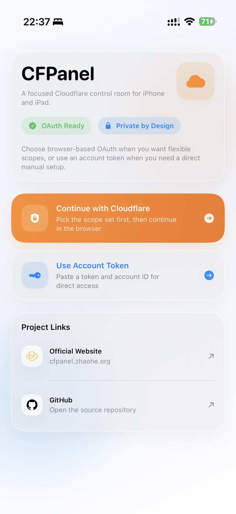
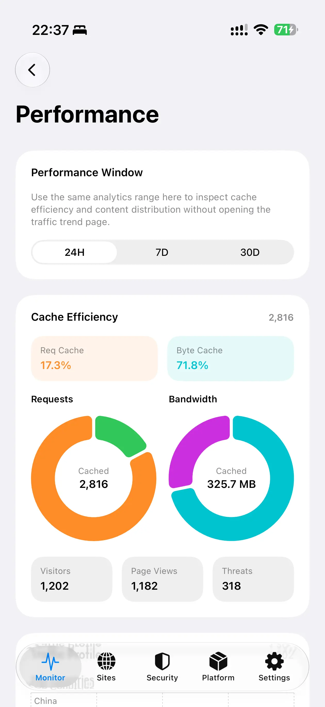
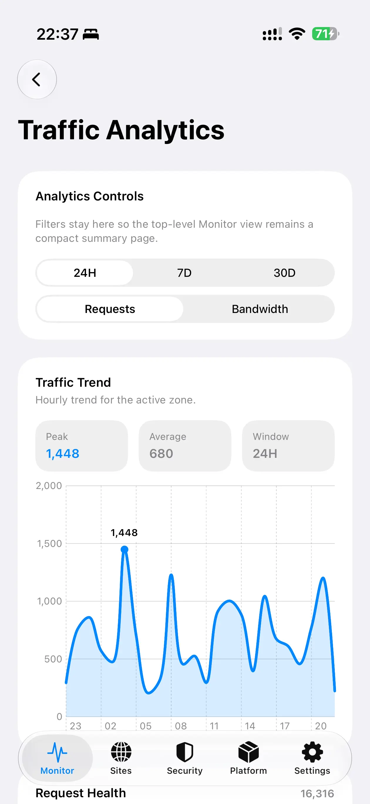

# CFPanel

[中文说明](./README.zh-CN.md)

Native Cloudflare management for iPhone and iPad.

CFPanel is an independent iOS client built for people who need to inspect infrastructure, respond to incidents, and make targeted Cloudflare changes from a mobile device without fighting the desktop dashboard in a browser.

## Links

- App Store: [CFPanel on the App Store](https://apps.apple.com/us/app/cfpanel/id6760587250)
- Website: [cfpanel.zhaohe.org](https://cfpanel.zhaohe.org)
- GitHub: [resistanceto/CFPanel](https://github.com/resistanceto/CFPanel)

## Screenshots

<table>
  <tr>
    <td></td>
    <td></td>
    <td></td>
  </tr>
</table>

## Why CFPanel Exists

Cloudflare has become a core part of how many of us ship and operate products, but the mobile dashboard experience is still awkward when you actually need to do work quickly.

CFPanel also exists because Cloudflare has built a platform that gives individual developers and small teams access to infrastructure capabilities that used to be much harder to reach. That openness is a big part of why tools like this can exist at all.

CFPanel exists to make those moments easier:

- check a site or account quickly
- inspect infrastructure while away from a laptop
- handle urgent DNS or security actions
- review Workers, Pages, storage, and platform resources from a phone

## What You Can Do

CFPanel is focused on real operational workflows, including:

- Cloudflare OAuth and scoped token sign-in
- site and zone browsing
- DNS record management
- TLS, caching, and security controls
- Workers inspection and route visibility
- Pages project and deployment visibility
- KV, R2, D1, Queues, Vectorize, and other account resources
- rulesets and incident-response style actions

## Trust Model

CFPanel is designed around a simple trust model:

- direct device-to-Cloudflare communication
- no credential relay backend
- scoped access only
- sensitive credentials stored in Keychain
- operational data fetched live as needed

For a Cloudflare management app, this matters. The goal is not just to be useful, but to be trustworthy.

## Why It Is Free

Most tools in this category put important workflows behind subscriptions or feature locks.

CFPanel does not.

The app is intentionally free because the original goal was to build something genuinely useful for the Cloudflare community, not to gate basic infrastructure workflows behind a paywall.

## Support CFPanel

If CFPanel saves you time or helps you manage real infrastructure more effectively, support helps keep the project sustainable.

Support helps fund:

- ongoing maintenance
- App Store distribution costs
- test devices
- Cloudflare API compatibility work
- UI and authentication improvements

Support is optional, but meaningful.

- Sponsor CFPanel: [afdian.com/a/ResistanceTo](https://afdian.com/a/ResistanceTo)

You can also help by:

- sharing the app
- filing useful feedback
- starring the project
- leaving an App Store review

## Project Notes

- CFPanel is an independent third-party client.
- It is built for the Cloudflare ecosystem and uses Cloudflare's public APIs.
- Cloudflare names and product marks belong to Cloudflare, Inc.
